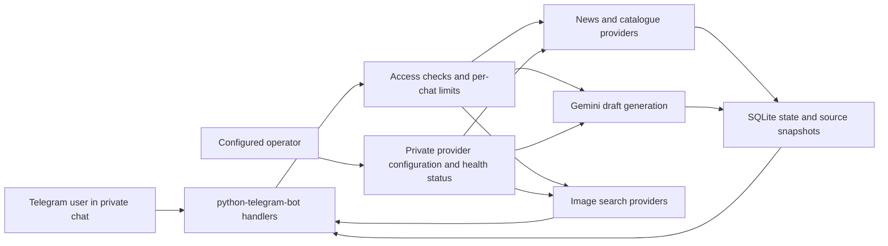

# Project overview

## Entertainment News Creator Bot

An asynchronous Telegram bot that helps readers follow film and television news and helps creators prepare Burmese-language articles. Users browse stories, choose a source item, generate a draft, adjust its length and tone, and save their own drafts for later review.

This document is written as a portfolio-ready technical walkthrough. It describes the source project without exposing deployment addresses, bot credentials, API keys, or production data.

## The problem it solves

Entertainment coverage is spread across publisher feeds, news search, release calendars, and film catalogues. Turning those items into readable Burmese copy takes additional research and writing time. The bot brings the discovery and drafting steps into one private Telegram conversation while retaining the original source for fact checking.

## Main user journey

1. Start the bot and choose an industry or search for a title/topic.
2. Browse a short list of sourced news and catalogue records.
3. Create a Burmese draft from a selected item, then adjust its style or request a rewrite.
4. Search for related images with source, creator, and license details where available.
5. Reopen a previously saved draft with `/posts`.

The bot labels TMDB items as catalogue information, not reporting. Generated copy is a draft and should be checked against its source before publication.

## Architecture



### Runtime components

- `bot.py` defines Telegram commands, callbacks, source fetching, Burmese prompt construction, and application startup.
- `entnews/runtime.py` provides shared asynchronous HTTP access, bounded provider execution, health state, and secret redaction.
- `entnews/storage.py` provides SQLite persistence, transactional legacy import, story/message bindings, draft ownership filtering, and backups.
- `tests/` contains offline unit and regression tests. CI runs the checks on Linux and Windows with Python 3.12.
- `ops/` contains secret scanning, token rotation, and production release guidance.

### External services

| Service | Purpose | Configuration |
| --- | --- | --- |
| Telegram Bot API | User interface and long polling | `TELEGRAM_BOT_TOKEN` |
| Google News and publisher RSS | No-key news discovery | Feed list in `bot.py` |
| NewsAPI | Optional reported articles | `NEWSAPI_KEY` |
| TMDB | Optional film/TV catalogue and release dates | `TMDB_TOKEN` |
| Gemini | Optional Burmese article drafting | `GEMINI_API_KEY`, `GEMINI_MODEL`, and fallback model |
| Openverse and Wikimedia Commons | Image search and attribution data | No key required by current integration |
| Pexels | Optional image search | `PEXELS_API_KEY` |

Provider failures are isolated so one unavailable source does not prevent the other configured sources from responding. Requests have timeouts and bounded retries.

## Public access and privacy

- Public use is supported in private chats. Group chats are rejected to avoid exposing drafts and preferences to group members.
- Each chat has its own selection, style, result cache, and saved drafts. Draft retrieval filters by the owning chat ID; pre-existing ownerless drafts remain available to the configured operator only.
- Public AI generation has configurable per-chat daily and cooldown limits plus a shared daily limit. These limits help protect the operator's shared provider quotas.
- `/status` and `/setkey` are restricted to the optional `ADMIN_TELEGRAM_ID`. If no operator ID is set, provider keys must be supplied through the environment.
- Telegram private chats are not end-to-end encrypted with the bot operator. The operator's host stores the bot's SQLite state and environment file; those files must remain private.

## Data and reliability decisions

- SQLite stores chat preferences, story snapshots, Telegram message-to-story bindings, drafts, health information, and daily public generation usage.
- A button references the story shown when it was created. Reply actions resolve against the source message instead of silently using a different current result.
- Legacy `news.json` and `posts.json` data is validated and imported transactionally on first startup. Originals are retained.
- Daily database backups keep the latest seven local copies. Production operators should also maintain an off-host backup.
- The bot is designed as one long-polling process. Starting a second instance with the same Telegram token can cause polling conflicts.

## Local development

1. Install Python 3.12 and create a virtual environment.
2. Install runtime and development requirements.
3. Copy `.env.example` to `.env` and add a Telegram token. Provider keys and an operator ID are optional.
4. Run `python bot.py` for local Telegram polling, using a separate bot token from production.
5. Run the offline checks:

```powershell
.venv\Scripts\python.exe -m unittest discover -v
.venv\Scripts\ruff.exe check bot.py entnews tests
```

The test suite uses temporary databases and mocked network operations. It does not send Telegram messages or require paid provider credentials.

## Portfolio highlights

- Async integration across multiple external providers with isolated errors and explicit health state.
- A private-chat access model for a public bot, with protected operator commands and per-user draft privacy.
- SQLite migrations, durable source-to-message bindings, and rollback-aware backups.
- Burmese generation prompts that distinguish reported news from user-editable catalogue data.
- Security-conscious deployment practices: secret scanning, environment-based credentials, and a restricted system service account.

## Known limitations

- Generated Burmese still needs human editorial and factual review; language quality can vary by model and source detail.
- Provider quotas and availability are controlled by their respective services. Public rate limits bound, but cannot eliminate, shared quota consumption.
- Catalogue providers may contain incomplete, user-edited, or stale metadata.
- Image search metadata does not determine whether an image is legally reusable.
- The current deployment model is a single-process VPS service, not a horizontally scaled hosted platform.

## License

No license is included yet. Public visibility on GitHub does not grant permission to reuse or redistribute this project. Choose a license before inviting contributions or granting reuse rights.
